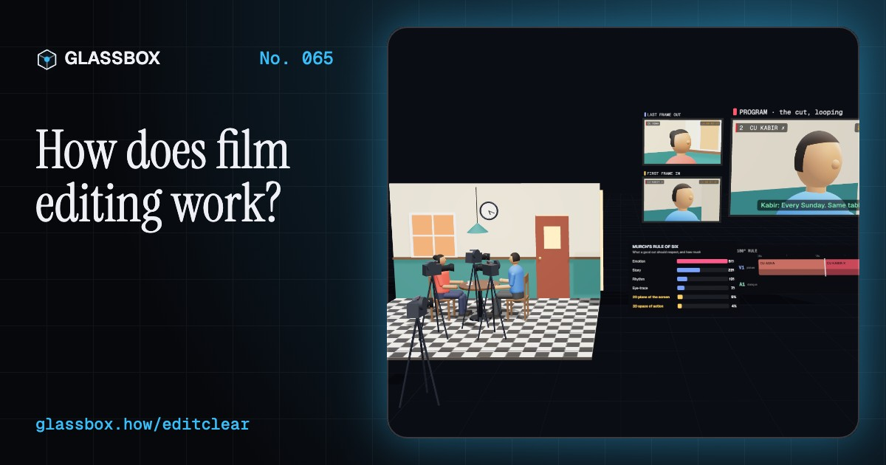
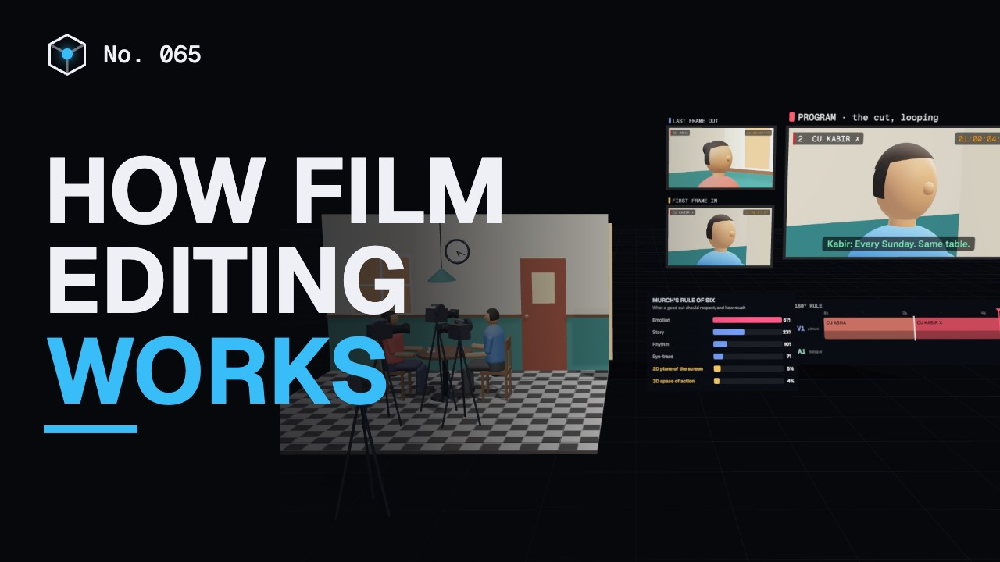
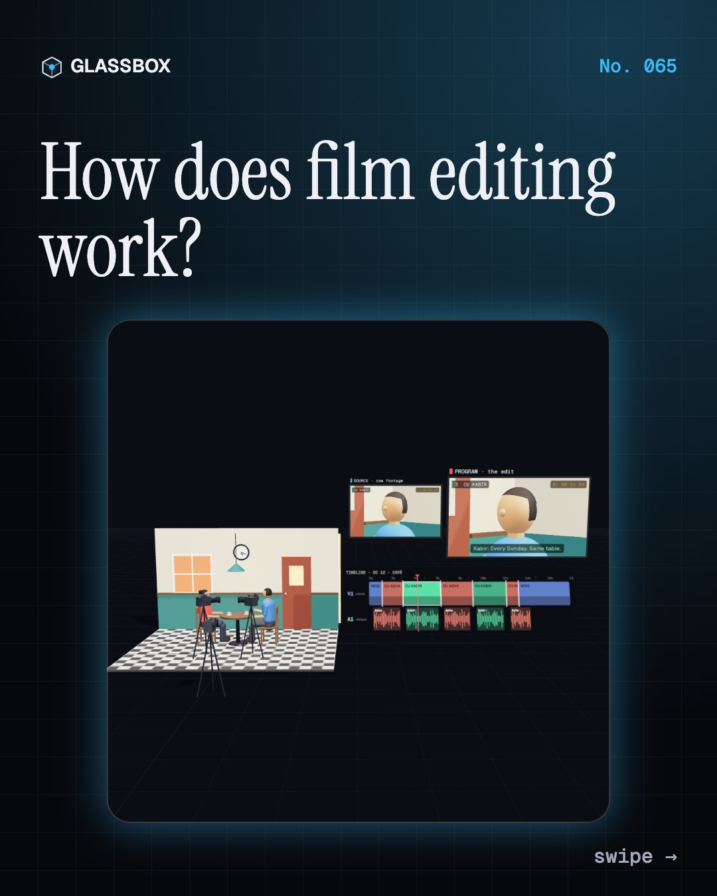
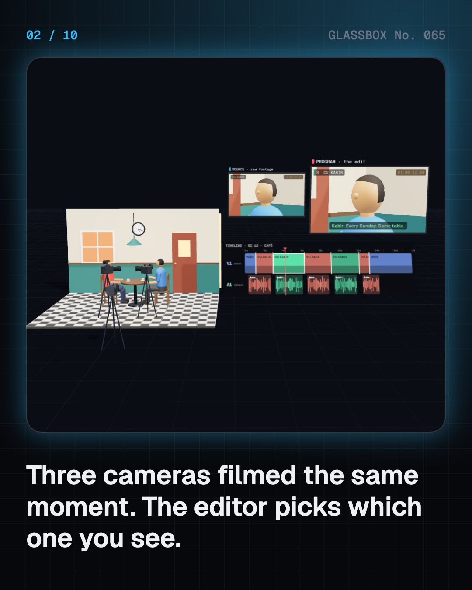
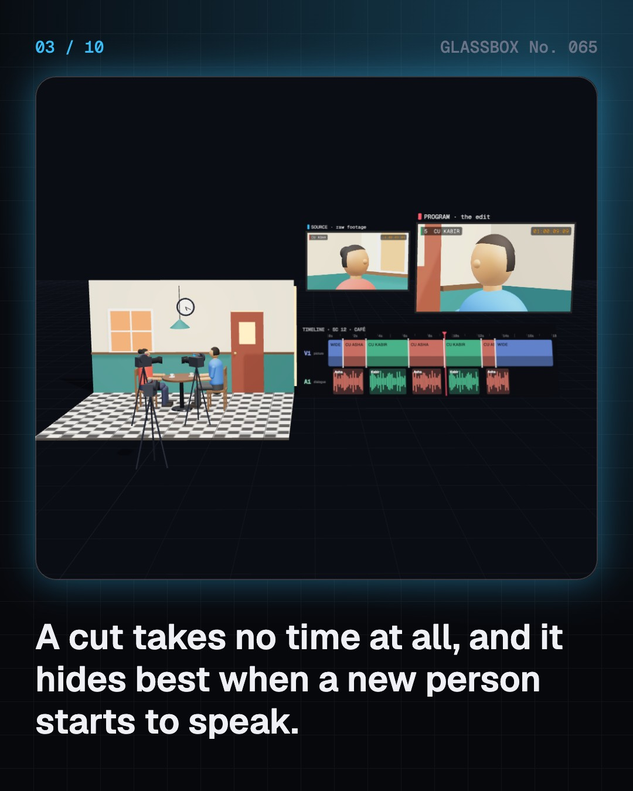
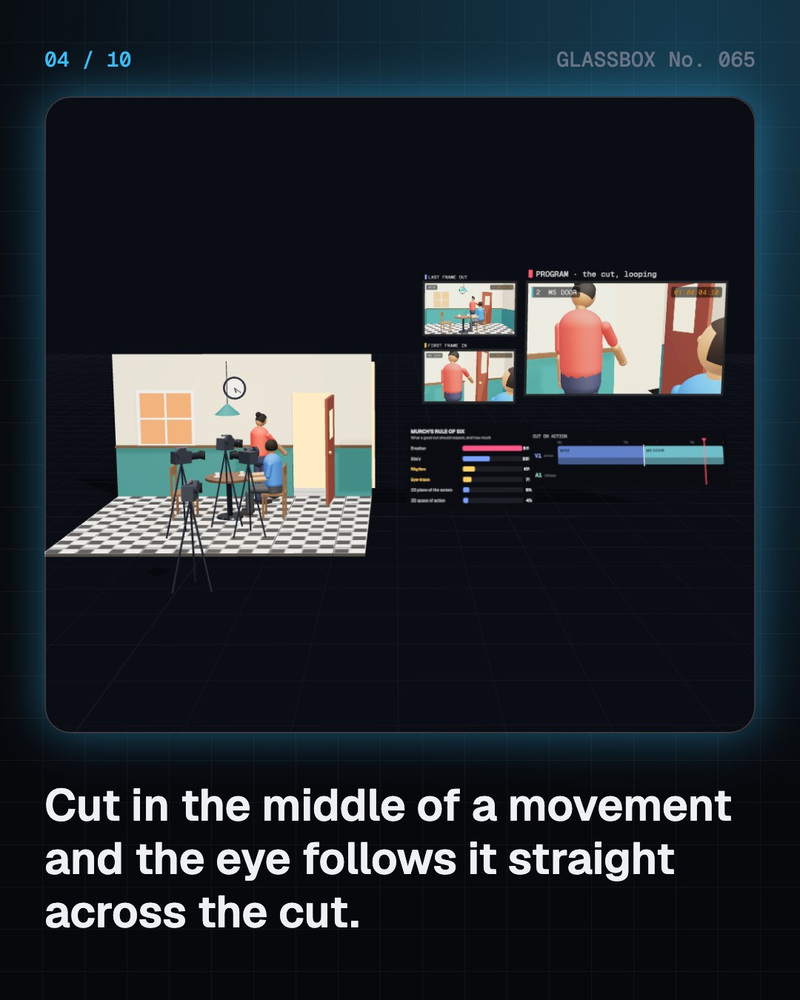

<!-- glassbox:start -->
<!-- Generated from glassbox.json by the Glassbox hub (npm run readme -- editclear). Edit glassbox.json, not this block. -->
<p align="center"><a href="https://glassbox.how/e/editclear/"></a></p>

<h1 align="center">EditClear</h1>

<p align="center"><b>How does film editing work?</b><br>Three cameras filmed the same café scene. Cut it yourself on a live timeline, drag a cut on an opening door until it jumps, put the same blank face next to soup or a coffin, and speed a scene up from 10-second shots to 1.5.</p>

<p align="center"><a href="https://glassbox.how/editclear/"><b>▶ Play with it</b></a> &nbsp;·&nbsp; <a href="https://glassbox.how/e/editclear/">Read the 60-second explainer</a> &nbsp;·&nbsp; <a href="https://glassbox.how/editclear/glassbox/reel.mp4">Watch the 40-second video</a></p>

<p align="center">
  <a href="https://glassbox.how/e/editclear/"></a>
  <a href="https://glassbox.how/e/editclear/"></a>
  <a href="LICENSE"></a>
  <a href="LICENSE-CONTENT.md"></a>
  <a href="#privacy"></a>
</p>

## In 60 seconds

1. **Choosing what you see.** A scene is filmed from several set-ups, like a wide shot and two close-ups. The editor lays shots end to end on a timeline and decides, moment by moment, which one you watch. A cut takes no time: one frame is the old shot, the next is the new one.
2. **Hiding the cut.** Continuity editing keeps time and space flowing: cut in the middle of a movement, show someone looking and then what they see, match shapes, keep cameras on one side of the 180° line. Break a rule, like Breathless's jump cuts in 1960, and the cut suddenly shows.
3. **Meaning from the join.** In Kuleshov's famous experiment the same blank face seemed hungry next to soup and grieving next to a coffin. Eisenstein built a theory of montage on the idea that shots collide to make meaning. Modern studies find a real but modest effect.
4. **Pace and sound.** Hollywood's average shot fell from about 10.5 seconds (1930 to 1955) to about 4.3 seconds (1990 to 2015), and many action films cut every 2 to 4 seconds. In J-cuts and L-cuts the sound changes before or after the picture, which makes conversations flow.
5. **Transitions.** Most joins are cuts, so the rarer transitions carry a message. A dissolve says time has passed, a fade ends a section, a wipe says meanwhile, and a smash cut jolts from quiet to loud. A montage squeezes hours into seconds.
6. **From dailies to picture lock.** Editors watch the dailies, build an assembly, then a rough and a fine cut until picture lock. They cut with small proxies, then the edit decision list lets the online stage rebuild the film from the huge camera files, add VFX, grade and mix. Indian films are also shaped around an interval and songs.

## Words worth knowing

| Term | Meaning |
|---|---|
| **Cut** | An instant change from one shot to the next. |
| **Timeline** | The editor's workspace: shots laid end to end on picture and sound tracks. |
| **Continuity editing** | Cutting so that time, space and action seem to flow on without a break. |
| **180° rule** | Keep the camera on one side of the line between two people so they keep their sides of the screen. |
| **Jump cut** | A cut that removes time from one shot, so things seem to leap. |
| **Kuleshov effect** | Viewers read different feelings into the same face depending on the shot next to it. |
| **Average shot length** | Running time divided by the number of shots. |
| **J-cut and L-cut** | Split edits where the sound changes before (J) or after (L) the picture. |
| **Picture lock** | The point where the edit is final and the film moves on to VFX, grading and the sound mix. |

## A short history

**A century and more from a jammed camera in Paris to editing a Hollywood epic on a Mac.**

- **1903** · The Great Train Robbery (Edwin S. Porter, Edison Manufacturing Company, New Jersey, USA)
- **1920** · The Kuleshov experiment (Lev Kuleshov, with actor Ivan Mosjoukine, Moscow, Russia)
- **1924** · The Moviola (Iwan Serrurier, Los Angeles, USA)
- **1925** · Battleship Potemkin and the Odessa Steps (Sergei Eisenstein, Moscow, USSR)
- **1960** · Breathless and the jump cut (Jean-Luc Godard, editor Cécile Decugis, Paris, France)
- **1971** · The first non-linear editor (CMX Systems (CBS and Memorex), California, USA)
- **1989** · Avid Media Composer (Avid Technology, Massachusetts, USA)
- **1989** · Renu Saluja's first National Award (Renu Saluja, Bombay, India)

The full story, with 27 moments, charts, people and 41 sources: [glassbox.how/e/editclear/history](https://glassbox.how/e/editclear/history/). The data lives in [`history.json`](history.json).

## Video and slides

Made with the Glassbox studio from this box's storyboard (`window.glassbox.director`). Free to reuse under CC BY 4.0.

<a href="https://glassbox.how/editclear/glassbox/video.mp4"></a>

<p><a href="glassbox/slide-1.jpg"></a> <a href="glassbox/slide-2.jpg"></a> <a href="glassbox/slide-3.jpg"></a> <a href="glassbox/slide-4.jpg"></a></p>

| File | What | Size |
|---|---|---|
| [`glassbox/reel.mp4`](https://glassbox.how/editclear/glassbox/reel.mp4) | Reel / Short, with captions and soundtrack | 1080×1920 |
| [`glassbox/video.mp4`](https://glassbox.how/editclear/glassbox/video.mp4) | YouTube video, with captions and soundtrack | 1920×1080 |
| `glassbox/slide-1…10.jpg` | Instagram carousel | 1080×1350 |
| `glassbox/thumb.jpg` | YouTube thumbnail | 1280×720 |
| `glassbox/cover.jpg` | Share card and repo social preview | 1200×630 |
| [`glassbox/history-reel.mp4`](https://glassbox.how/editclear/glassbox/history-reel.mp4) | “History in 10 moments” Reel / Short | 1080×1920 |
| `glassbox/history-slide-*.jpg` | History carousel | 1080×1350 |
| `glassbox/post.json` | Post copy and schedule used by the publish kit | |

## Privacy

This box has no accounts and no ads, and it ships its own fonts and libraries. When you run it yourself it sends nothing anywhere. On glassbox.how, the site's `/bar.js` also loads Glassbox's analytics: **Google Analytics** to count visits (it asks first in the EU, UK and Switzerland, and stays off when your browser sends Global Privacy Control or Do Not Track) and **ClickTrust** to detect bots.

It remembers a few things **in your own browser only**, and never sends them anywhere:

| Browser storage key | What it holds |
|---|---|
| `editclear.v1` | Which chapters you have opened, your best quiz scores, and sound on or off. |

Exactly what each one sees is at [glassbox.how/privacy](https://glassbox.how/privacy/).

## Licences

- **Code:** [MIT](LICENSE). Use it, change it, ship it.
- **Explanations, text, images and videos** (`glassbox.json`, `glassbox/`): [CC BY 4.0](LICENSE-CONTENT.md). Credit “Glassbox, glassbox.how/e/editclear”.
- **Third-party parts** keep their own licences: [three.js](https://threejs.org) (MIT), [Geist, Instrument Serif](https://openfontlicense.org) (SIL OFL 1.1).
- The Glassbox name and logo aren't covered by either licence. See the [terms](https://glassbox.how/terms/).

Found a mistake? [Open an issue](https://github.com/bdeeps/editclear/issues). Corrections happen in public.
<!-- glassbox:end -->

## Run it

It's plain HTML, CSS and JavaScript. No build step and no dependencies. Run locally, it contacts no other website.

```bash
python3 -m http.server 8000
```

Three.js and the fonts ship in `vendor/` and `fonts/`, so it also works offline.

Then open http://localhost:8000.

## How it's built

| File | What |
|---|---|
| `index.html`, `css/app.css` | The page and its styles |
| `js/app.js`, `js/stage.js`, `js/ui.js`, `js/kit.js` | The shared Glassbox 3D engine: chapters, 3D stage, controls, quiz, video director |
| `js/edit.js` | The editing suite shared by the chapters: a café set with two faceless mannequins acting an original scene, virtual cine cameras rendering live into monitors, a mixing shader for cuts, dissolves, fades and wipes, the timeline board, timecode and the EDL |
| `js/chapters/*.js` | One file per chapter: the 3D model, controls, text, key terms, quiz and video scenes |
| `glassbox.json` | Title, question, explainer beats, key terms, browser storage and credits shown on glassbox.how |
| `reel` in each chapter | The storyboard the Glassbox studio records into short videos |
| `glassbox/` | The published video, slides, thumbnail and post copy |
| `fonts/`, `vendor/three/` | Self-hosted Geist and Instrument Serif (SIL OFL 1.1) and three.js (MIT) |
